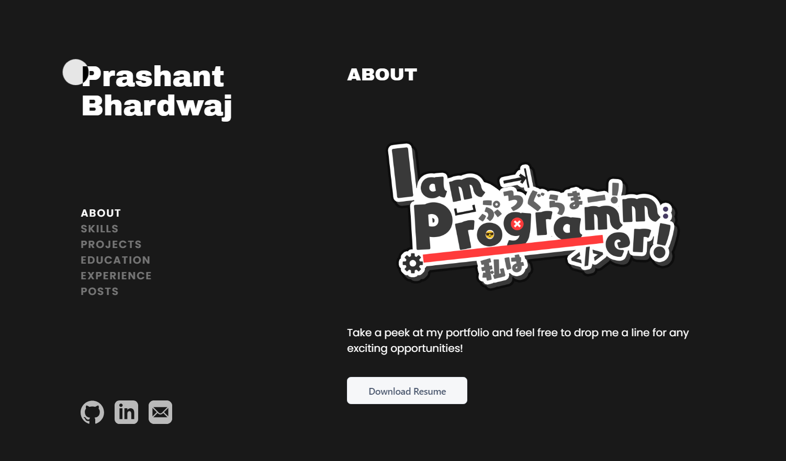

<div align="center">
<h1 align="center">

<br>jasperwang.dev</h1>
<h3>◦ Developed with the software and tools below.</h3>

<p align="center">


</p>


</div>

---

## 📖 Table of Contents

- [📖 Table of Contents](#-table-of-contents)
- [📍 Overview](#-overview)
- [🎈 Live Site](#-live-site)
- [🚀 Getting Started](#-getting-started)
  - [🔧 Installation](#-installation)
  - [🤖 Running Portfolio-XD](#-running-portfolio_v1)

---

## 📍 Overview

My personal portfolio website built using the Astro framework and hosted on Cloudflare Pages. The website is designed to be fast, accessible, and SEO-friendly. The website is built with a mobile-first design and is fully responsive on all devices.



---

## 🎈 Live Site

https://portfolio-xd.pages.dev/

---

## 🚀 Getting Started

### 🔧 Installation

1. Clone the Portfolio-XD repository:

```sh
git clone https://github.com/Prashant20nov2003/Portfolio-XD
```

2. Change to the project directory:

```sh
cd Portfolio-XD
```

3. Install the dependencies:

```sh
► npm install
```

### 🤖 Running Portfolio-XD

```sh
► npm run dev
```

---
